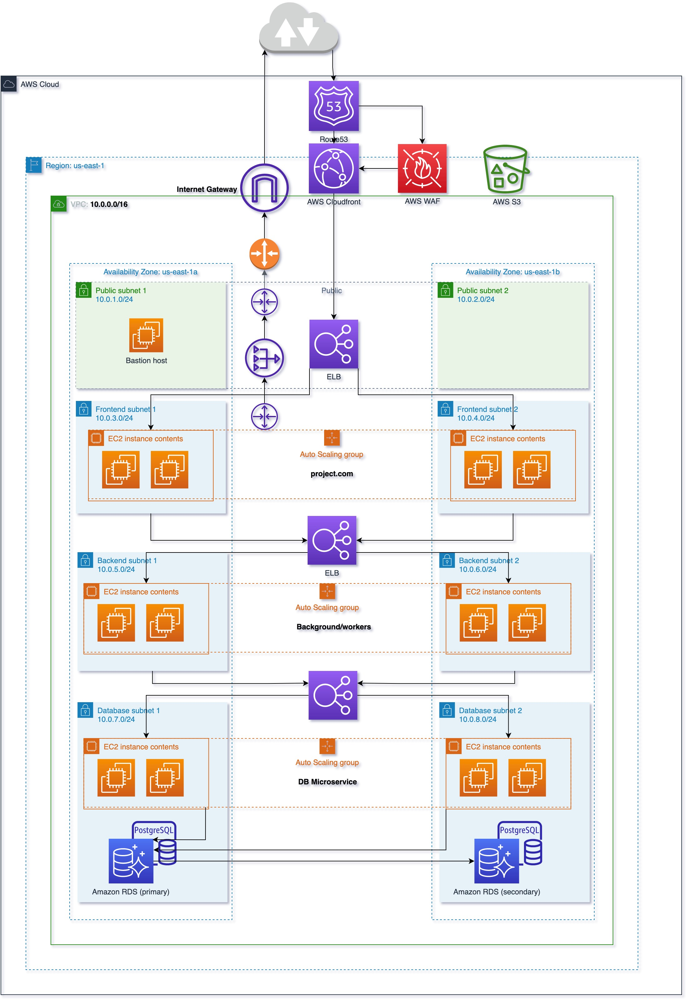

## Terraform cloud
- Register: https://app.terraform.io
- Create new Organization. Ex: `Lab000`
- Create new Workspace with CLI-driven workflow. Ex: `project-com-aws-draft`
 
## Terraform local
- Update Org name and Workspace name to `main.tf`
- Login: `terraform login`
- Init: `terraform init`

## Initial setup 

- Create SSH keypair for bastion and project
```
# Keypair for basion host
KEY_NAME=draft-project-key-bastion && ssh-keygen -t rsa -f key_pairs/$KEY_NAME -C $KEY_NAME

# Keypair for project host
KEY_NAME=draft-project-key-private && ssh-keygen -t rsa -f key_pairs/$KEY_NAME -C $KEY_NAME
```

- Login to AWS console:
  + Create new IAM User with follow policy:
    + AmazonEC2FullAccess, AutoScalingFullAccess, AmazonVPCFullAccess
    + Custom Inline Policy: CreateBastionIAMRole
```
{
    "Version": "2012-10-17",
    "Statement": [
        {
            "Effect": "Allow",
            "Action": [
                "iam:AttachRolePolicy",
                "iam:DeleteRolePolicy",
                "iam:DetachRolePolicy",
                "iam:GetRole",
                "iam:GetRolePolicy",
                "iam:ListAttachedRolePolicies",
                "iam:ListRolePolicies",
                "iam:PutRolePolicy",
                "iam:UpdateRole",
                "iam:UpdateRoleDescription",
                "iam:CreateRole",
                "iam:DeleteRole",
                "iam:TagRole",
                "iam:ListInstanceProfilesForRole",
                "iam:GetInstanceProfile",
                "iam:CreateInstanceProfile",
                "iam:RemoveRoleFromInstanceProfile",
                "iam:AddRoleToInstanceProfile",
                "iam:PassRole",
                "iam:DeleteInstanceProfile"
            ],
            "Resource": [
                "arn:aws:iam::*:role/*-iam-role-bastion",
                "arn:aws:iam::*:instance-profile/*-iam-profile-bastion"
            ]
        }
    ]
}
```
  + Create Keypair content use AWS Secrets Manager:
    ++ New Secret key: `project.com/aws/draft-project-key-private`
    ++ Past your keypair private content (this file `key_pairs/draft-project-key-private`) as Plain text

## Deploy

Make sure you update Terraform Variable to workspace first:

- AWS_ACCESS_KEY (sensitive)
- AWS_SECRET_KEY (sensitive)
- env=draft
- project=project
- public_key_pair_bastion (sensitive) = content of `key_pairs/draft-project-key-bastion.pub` file
- public_key_pair_project (sensitive) = content of `key_pairs/draft-project-key-private.pub` file

```
terraform apply
```

## Access to bastion host
```
ssh -i key_pairs/draft-project-key-bastion ubuntu@<bastion_public_ip>
```

### Access to private host

Only available in bastion host

```
ssh ubuntu@<project_private_ip>
```